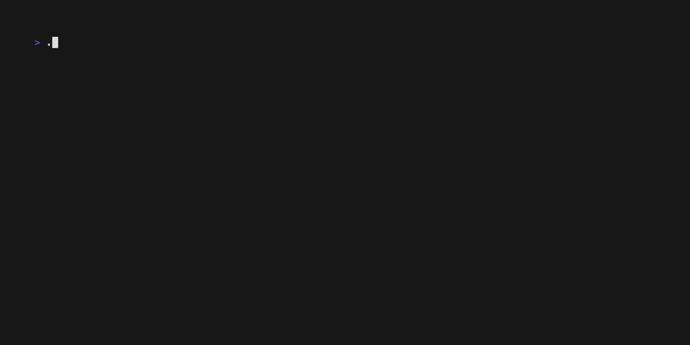

<p align="center"></p>
<p align="center">
  <a href="https://goreportcard.com/report/go.mongodb.org/mongo-driver"></a>
  <!-- <a href="https://pkg.go.dev/go.mongodb.org/mongo-driver/mongo"></a>
  <a href="https://pkg.go.dev/go.mongodb.org/mongo-driver/bson"></a>
  <a href="https://www.mongodb.com/docs/drivers/go/current/"></a> -->
</p>

# FileWatch

A file monitoring golang command line tool that can watch for modifications, creations and deletions of files and folders and send an event 

<p align="center"></p>

-------------------------
## Requirements

- Go 1.19 or higher. We aim to support the latest versions of Go.

- MongoDB 3.6 and higher.

-------------------------

## Usage

```
filewatch is a Go command-line tool that watches files and directories for changes.

Commands:
		set --path <path>		Sets the path to the file to watch
		run				Runs the file watcher
```

## Installation


## Contribution

Contribution details and guidelines are still work in progress.

-------------------------

## License

This Golang filewatch project is licensed under the [GNU](LICENSE).
